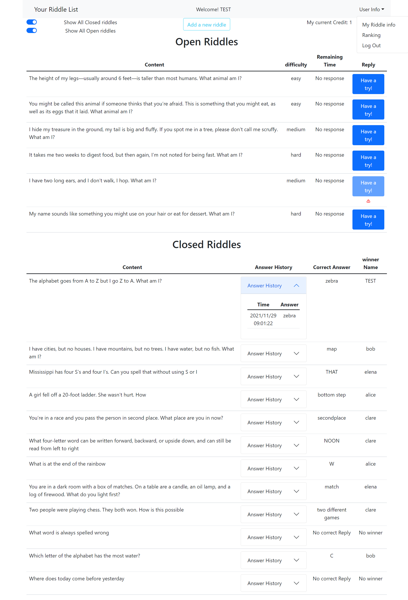

# Exam #2: "SolveMyRiddle"
## Student: s296187 JiaqiWu

## React Client Application Routes

- Route `/`: Main Page
- Route `/MyInfo`: Users' pushlished riddles 
- Route `/rankinng`: Users' ranking
- Route `/add` : Add new Riddle
= Route `/login`"Login Page
- Default Route: No page found

## API Server

### 1. History API

### _Get History By riddleId_

- GET `/api/history/:rid`
  - return the corresponding history by riddle id
  - request header: rid
  - request body : none
  - response: `200 OK`(success), `500 Internal Server Error`(generic error)
  - response body: A History

```
  [
    {
      "hid": 3,
      "rid": 12,
      "repId": 4,
      "answerTime": "2021/12/20 09:33:44",
      "answer": "NOON",
      "result": "T"
    },
  ...
]
```

### _Post History_

- POST `/api/history`
  - request parameters and body :The reply wait for saving in database 
  - response body : `200 OK`(success),`500 Internal Server Error`(generic error)

```
  {
        "rid": 1,
        "repId": 5,
        "answerTime": "syring",
        "answer": "giraffe"
    }
  ```

### 2. riddle API


### _List all Riddles_

- GET `/api/riddles`
  - return all riddles
  - request header: none
  - request body : none
  - response: `200 OK`(success), `500 Internal Server Error`(generic error)
  - response body: All riddles

```
[
  {
    "rid": 1,
    "content": "The height of my legs—usually around 6 feet—is taller than most humans. What animal am I?",
    "difficulty": "easy",
    "hint1": "h11",
    "hint2": "h12",
    "duration": 30,
    "state": "open",
    "answer": "giraffe",
    "createTime": "2021/1/29 09:33:11",
    "closeTime": "",
    "expiration": "",
    "authorId": 1
  },
  ...
]
```

### _Get Riddles By State_

- GET `/api/riddles/:state`
  - request parameters : state(with authorized)
  - response body : all open riddles 

```
[
  {
    "rid": 1,
    "content": "The height of my legs—usually around 6 feet—is taller than most humans. What animal am I?",
    "difficulty": "easy",
    "hint1": "h11",
    "hint2": "h12",
    "duration": 30,
    "state": "open",
    "answer": "giraffe",
    "createTime": "2021/1/29 09:33:11",
    "closeTime": "",
    "expiration": "",
    "authorId": 1
  },
  ...
]
```

### _Get Riddles By UserId_

- GET `/api/riddles/:uid`
  - request parameters : authorId(with authorized)
  - response body : the riddles created by the current authorId

### _Post Riddle_

- POST `/api/riddle`
  - request parameters : no
  - request body: Riddle
  - response  : `200 OK`(success), `500 Internal Server Error`(generic error)

```
  {
      "content": "test1",
      "difficulty": "t1",
      "hint1": "h11",
      "hint2": "h12",
      "duration": 30,
      "state": "open",
      "answer": "giraffe",
      "createTime": "2021/1/29 09:33",
      "closeTime": "",
      "authorId": 1
    }
```

### _Update Riddle state by its riddleId_

- PUT `/api/riddle/state/:rid`
  - request parameters : riddle Id
  - request body: riddle new state
  - response  : `200 OK`(success), `500 Internal Server Error`(generic error)

```
  {"state":"expire"}
```

### 3. User API


### _Get a user's info(only name and points) By UserId_

- GET `/api/user/:id`
  - request parameters:  userId to retrive user's information

### _Get a user's information_

- GET `/api/session/current`
  - response body : session information (userId, name, password...)

### _Delete a user's information_

- DELETE `/api/session/current`
  - request body: none

### _Post a user's information_

- POST `/api/session`
  - login checked

### _Get all users' points_

- Get `/api/users`
  - Get all user's necessary by order for Ranking


## Database Tables

- Table `users`
  - id
  - name
  - surname
  - email
  - password
  - salt
  - points
- Table `History` 
  - hid
  - rid
  - repId
  - answerTime
  - answer
  - result(T/F)
- Table `Riddle` 
  - rid
  - content
  - difficulty
  - hint1
  - hint2
  - duration
  - state
  - answer
  - ceateTime
  - closeTime
  - expiration
  - authorId


## Main React Components

- `ClosedRiddlesTable` (in `MyRiddlesTable.js`): For rendering all closed riddles which created by current user
- `MyOpenRiddlesTable` (in `MyRiddlesTable.js`): For displaying all ongoing riddles which created by current user
- `OpenRiddlesTable` (in `LoginRiddlesTable.js`): For showing all onging riddles, and allow user to try 
- `RiddleForm` : For adding the new riddle


## Screenshot





## Users Credentials

|UserName|Password
|---|--
|test@polito.it|password|
|su@studenti.it|password|
|gu@google.it|password|
|pa@test.it|password|
|test@test.it|password|
|qi@test.it|password|
